

  <h1>autoWDS</h1>
  <h4>Esta herramienta esta creada con el fin de automatizar la intalacion de y configuracion de todos los requerimientos necesarios para crear un WDS, utilizando PowerShell.</h4>

<ul>
    <li>Es te script es capaz de configurar la IP del Windows Server 2016 y los DNS, que previamente hallamos definido en el script.</li>
    <li>En los comentarios del script se puede encontrar también una pequeña explicación de como cambiar los servidores NTP del SO.</li>
</ul> 

Requisitos
======
Este escript está realizado para Windows Server 2016 por lo que si se ejecuta en otro sistema puede que ocasiones problemas al intentar crear el WDS.

CONFIGURACION
======
<h4>INTERFAZ DE RED</h4>

Debemos definir en el scriptlos siguientes parametros

<ul>
    <li>ifIndex</li>
    <li>ipParam</li>
    <li>dnsParams</li>
</ul> 

  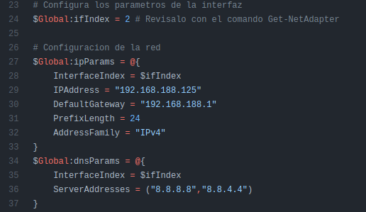

<h4>NOMBRE DEL EQUIPO Y DOMINIO</h4>

Debemos definir en el scriptlos siguientes parametros

<ul>
    <li>namePc</li>
    <li>domainName</li>
</ul> 

  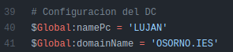

<h4>USUARIOS Y GRUPOS</h4>

En este caso no es obligatorio rellenarlo. Y aque la creacion de grupos y usuarios desde el script de powershell no es obligatoria.

<ul>
    <li>Usuarios:</li>
    <dl>
      <dt>ADUsers</dt>
      <dd>Nombre del usuario que se usara para iniciar sesion en el sistema.</dd>
      <dt>ADPasswords</dt>
      <dd>Contraseña de la cuenta de usuario.<dd>
      <dt>ADUserNames</dt>
      <dd>Nombre completo del usuario. Solo se puede poner el nombre y un apellido si pones dos apellidos, el 2º apellido no se usara.</dd>
    </dl>
    <li>Grupos:</li>
    <dl>
      <dt>ADGroups</dt>
      <dd>Nombre del grupo.</dd>
    </dl>
</ul> 

  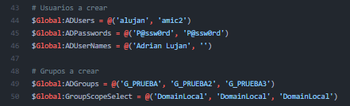

Ejecucion del script PowerShell
======

  <h4>Una vez ya hemos configurado todos los parametros necesarios, procedemos ha ejecutar PowerShell en Windows Server 2016 y importamos el modulo.</h4>

    Import-Module .\autoDC
    

  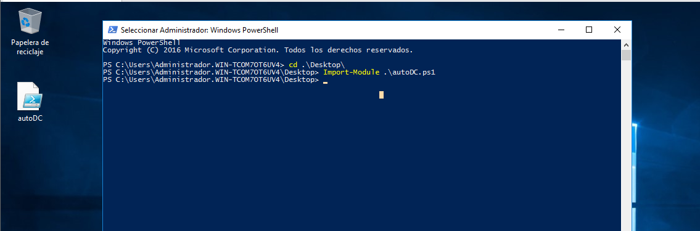

  <h4>Ejecutamos la funcion helpPanel. Y seguimos los pasos que nos indica.</h4>

    helpPanel
    

  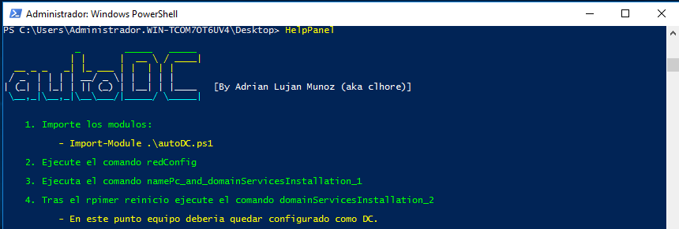

  <h4>Configuramos la red, utilizando la funcion redConfig.</h4>

    redConfig
    

  

  <h4>Ahora comenzamos con el cambio de nombre del equipo y con la parte 1 de la creacion del DC. Una vez acabe se reiniciara y deberas volver ha abrir PowerShell y importar el modulo.</h4>

    namePc_and_domainServicesInstallation_1
    

  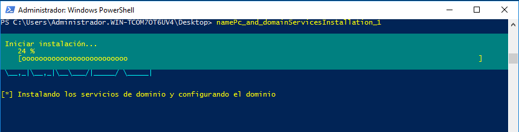

  <h4>Una vez se ha reiniciado importamos el modulo otravez.</h4>

    Import-Module .\autoDC
    

  

  <h4>Ejecutamos la parte dos de la creacion del DC. Una vez lo ejecutes te pedira la contraseña de Administrador. Cuando acabe se reiniciara.</h4>

    namePc_and_domainServicesInstallation_2
    

  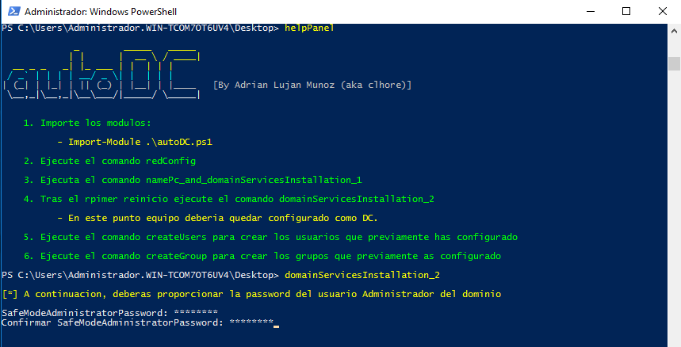 
  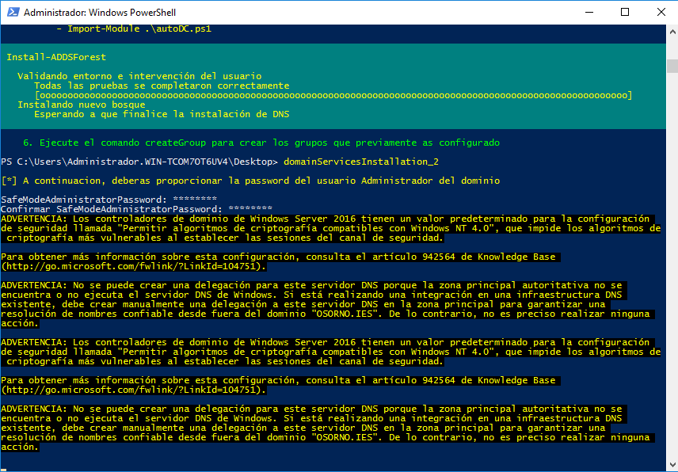 
  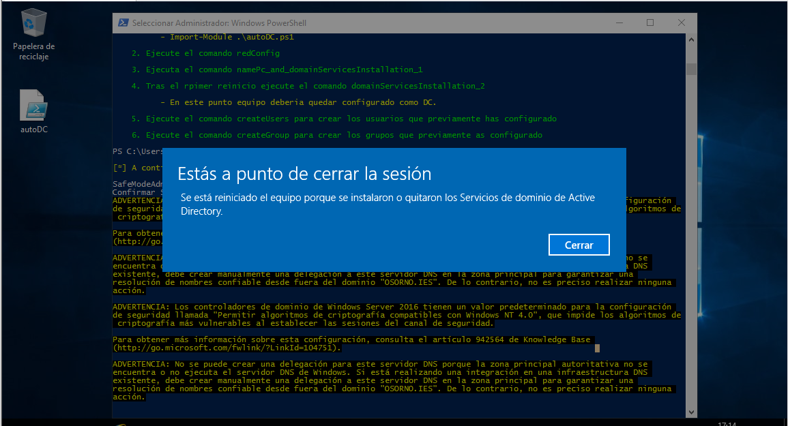 

  <h4>Es posible que se quede en una pantalla de carga durante un largao periodo de tiempo, no apages el equipo y deja que acabe.</h4>

  

  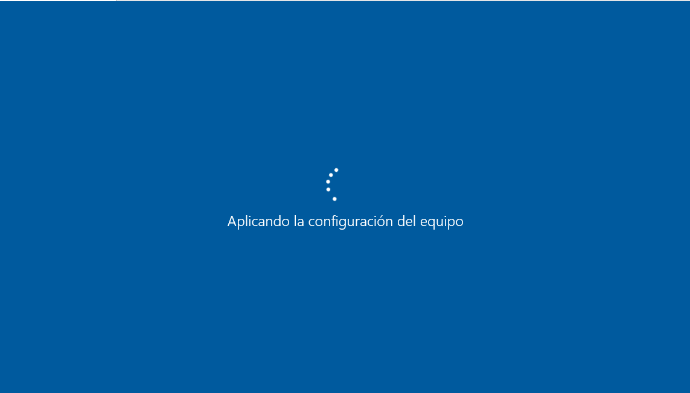 

  <h4>Una vez inicie si no a aavido ningun error el equipo deveria de quedar configurado como un DC.</h4>

    

  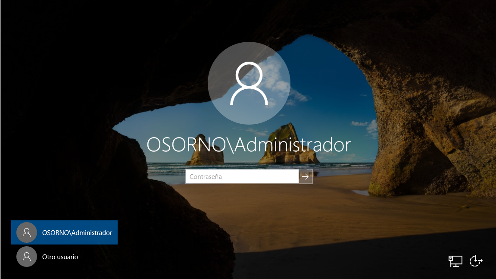 

